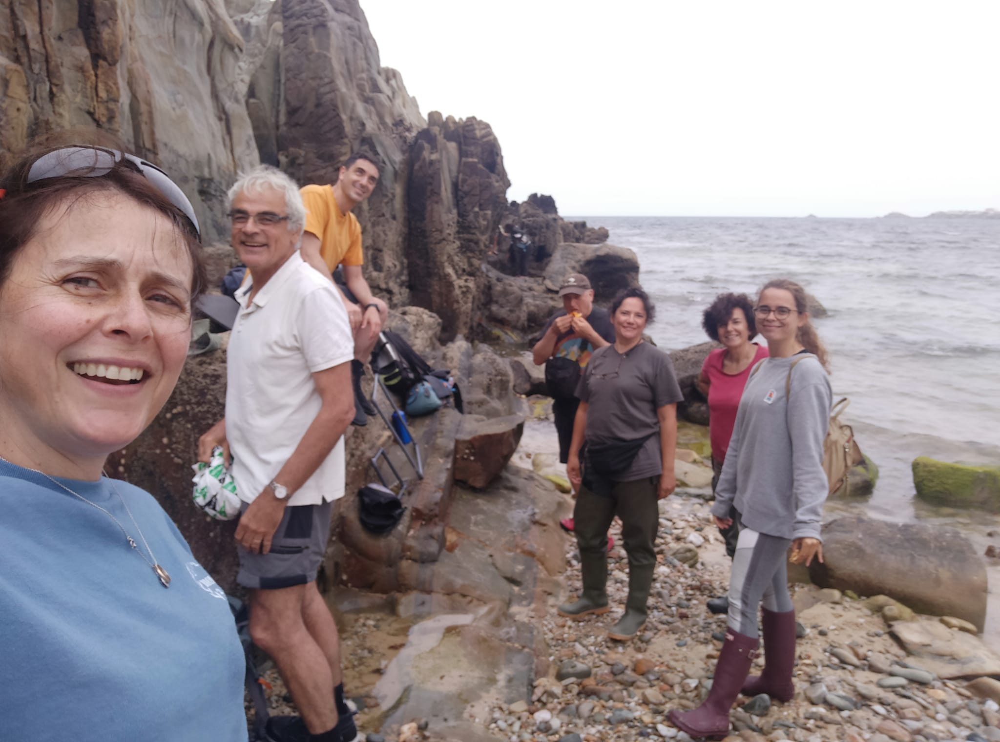
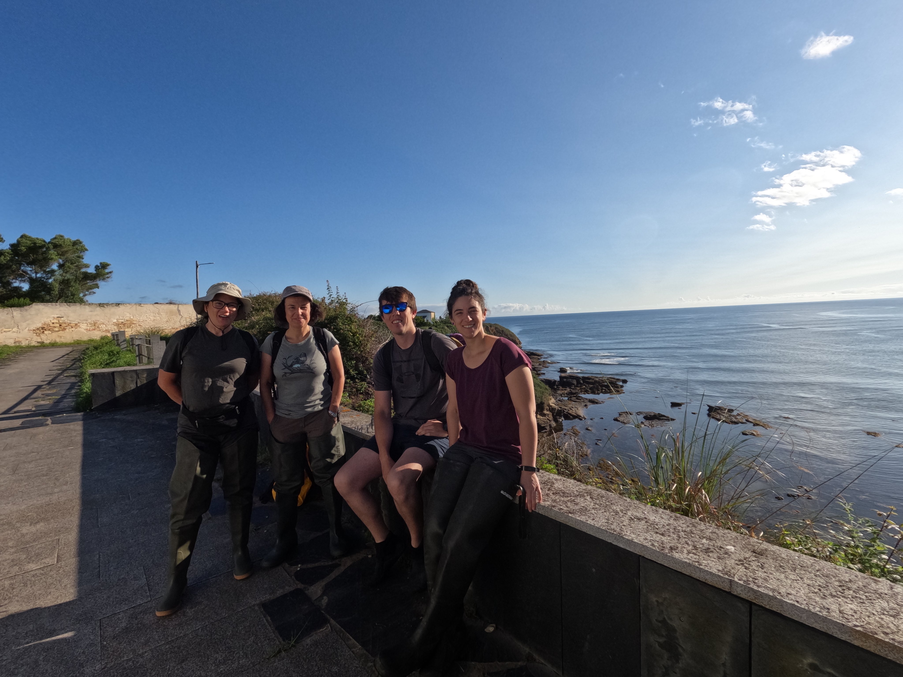
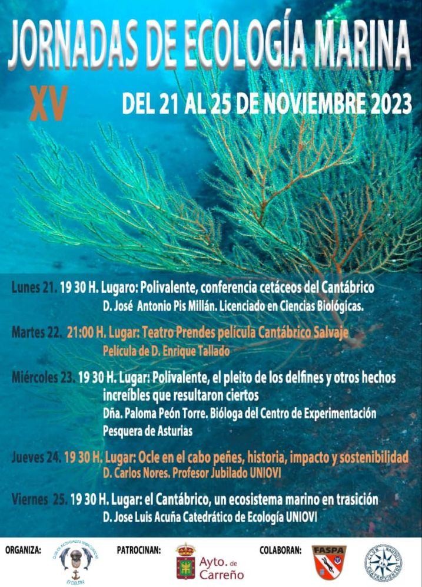
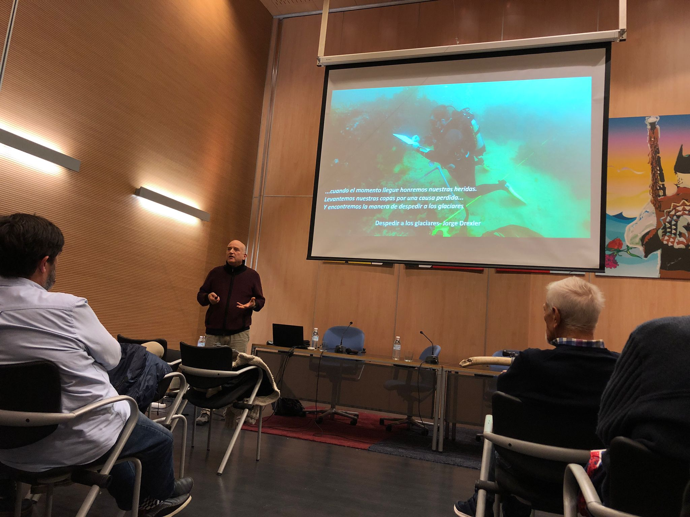
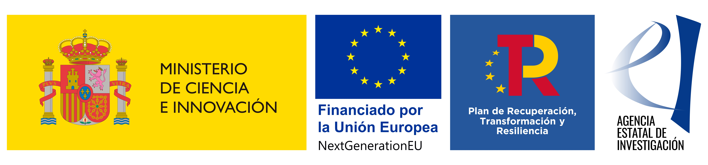

***

***
## 2023-2025 - InterMaREst - 

Preservación de poblaciones marginales de macroalgas intermareales generadoras de hábitat a través de datos digitales y prácticas de restauración in situ. 

Proyectos de Transición Ecológica y Transición Digital 2021 (TED2021-129997A-I00). Ministerio de Ciencia e Innovación. Universidad Rey Juan Carlos y Universidad de Oviedo. 

   
  

***
## DISSEMINATION

José Luis Acuña (Universidad de Oviedo) outlined IntermaRest objectives at the "XV Jornadas de Ecología Marina (21-25 Noviembre 2023)". 

   
  

***

## InterMaRest technician 
 
**Pelayo Rico** has joined InterMaRest... Welcome Pelayo!

***

## COLLECTING DATA

We started exploring the fitness of macroalgae in January 2023

***

***