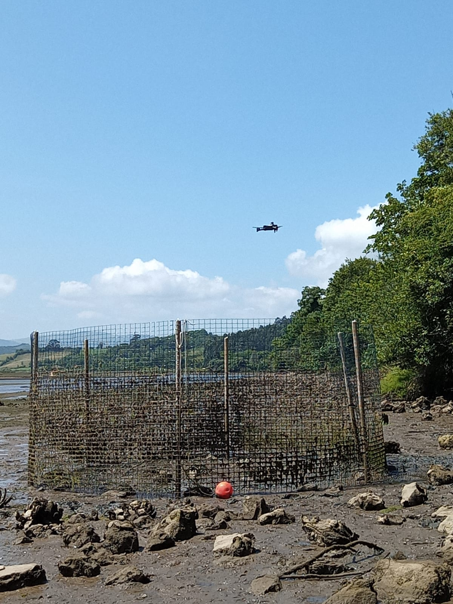
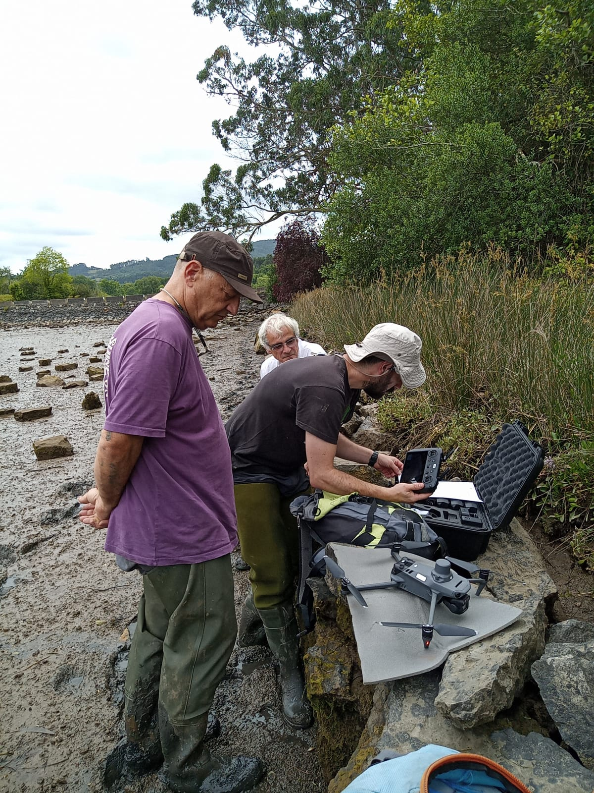
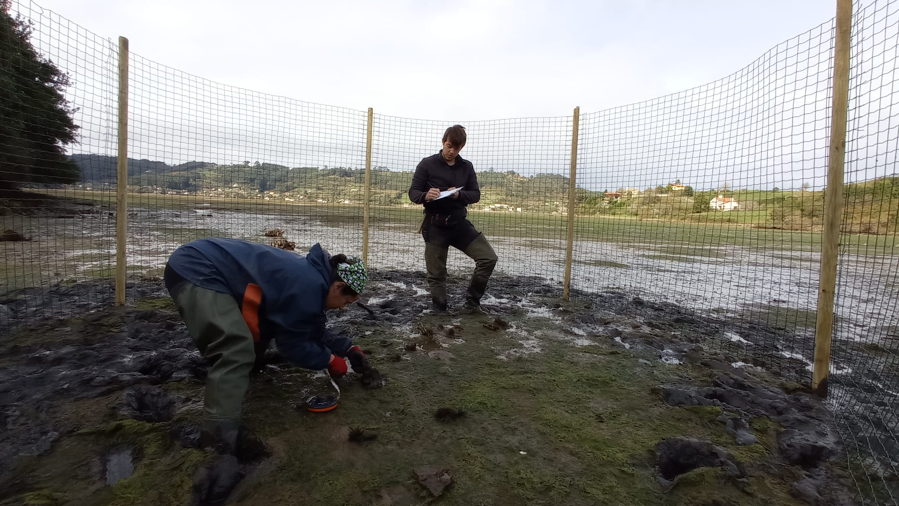
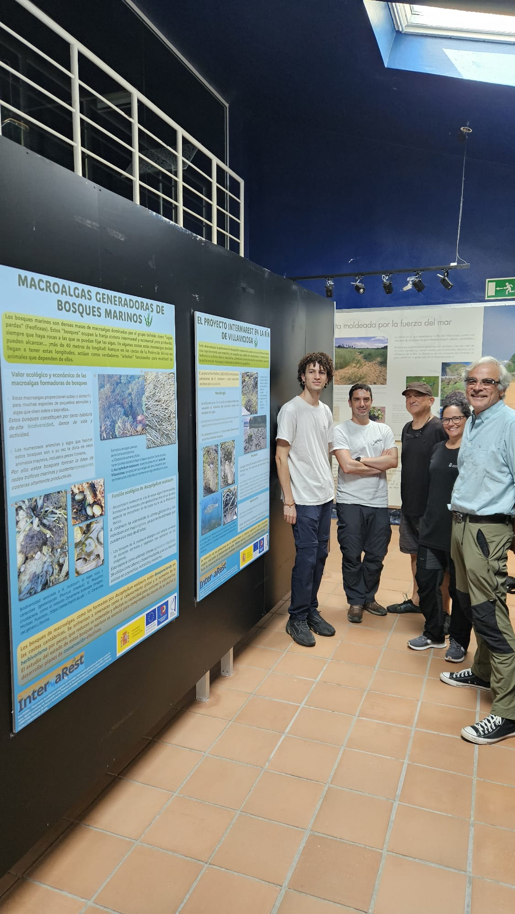
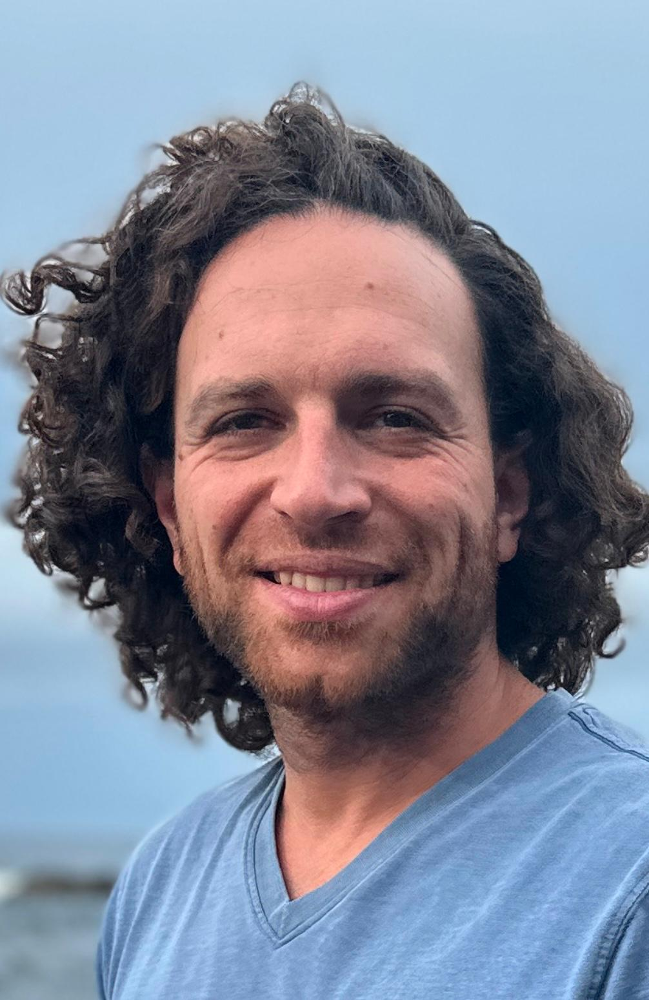

***

***
## 2023-2025 - InterMaREst - 

Preservación de poblaciones marginales de macroalgas intermareales generadoras de hábitat a través de datos digitales y prácticas de restauración in situ. 

Proyectos de Transición Ecológica y Transición Digital 2021 (TED2021-129997A-I00). Ministerio de Ciencia e Innovación. Universidad Rey Juan Carlos y Universidad de Oviedo. 

   
  

***

## Big exclusion cages in Villaviciosa Estuary (Asturias, Spain)

We have installed three exclusion cages to preserve and restore Ascophyllum nodosum populations. 

Drone imagery will help in our surveys in collaboration with the Universidad de Oviedo Team (special thanks to Carlos Guardado!)

   
  

***
## DISSEMINATION

InterMaRest project has exhibited **explanatory panels** showing some of our herbivory experiments and macroalgae restoration actions at the "Centro de Interpretación RNP de la Ría de Villaviciosa" in Asturias. 

Come and visit!

***

## XV Jornadas de Ecología Marina 

José Luis Acuña (Universidad de Oviedo) outlined IntermaRest objectives at the "XV Jornadas de Ecología Marina (21-25 Noviembre 2023)". 

   
  

***

## InterMaRest new team members 
 
During InterMaRest **Pelayo Rico** (technician) and **Carlos García-Lanchares** (postdoc) joined the URJC team

***

## COLLECTING DATA

We started exploring the fitness of macroalgae in January 2023

***

***