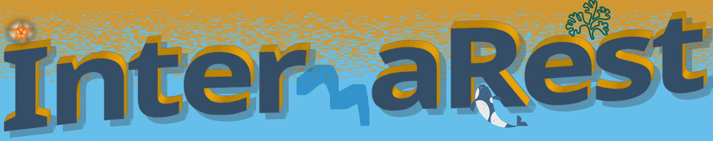

***

***
## 2023-2024 - InterMaREst - 

Preservación de poblaciones marginales de macroalgas intermareales generadoras de hábitat a través de datos digitales y prácticas de restauración in situ. 

Proyectos de Transición Ecológica y Transición Digital 2021 (TED2021-129997A-
I00). Ministerio de Ciencia e Innovación. Universidad Rey Juan Carlos y Universidad de
Oviedo. 

***
