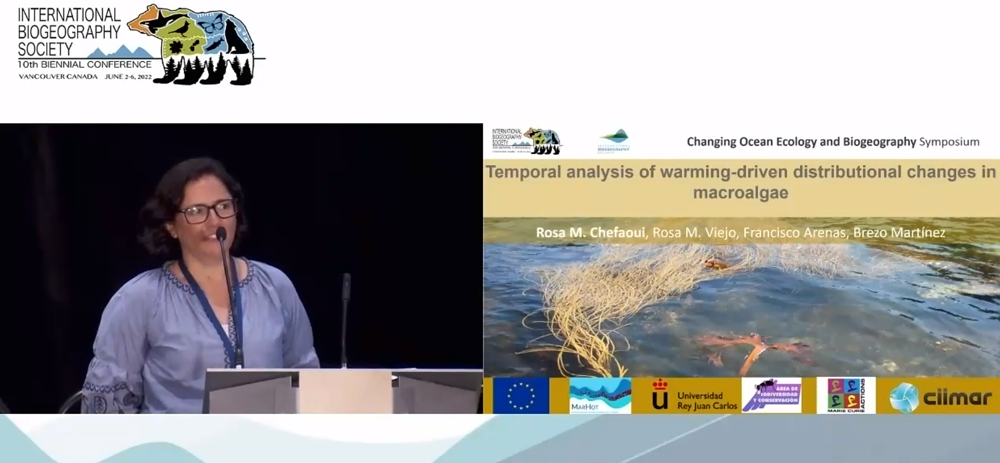
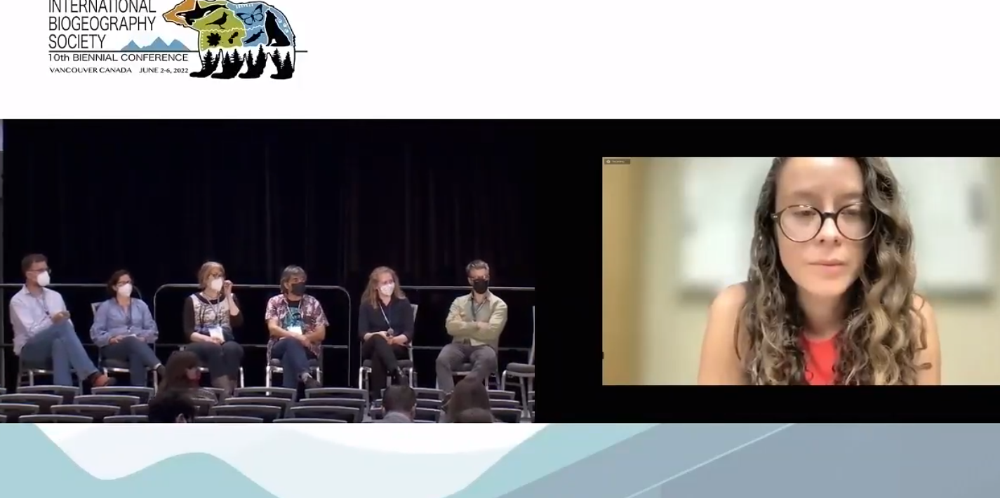
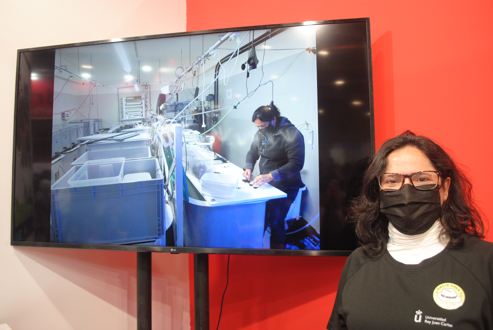
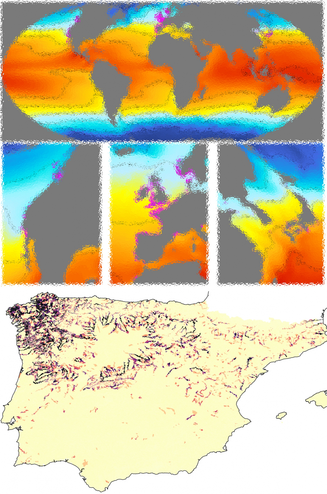
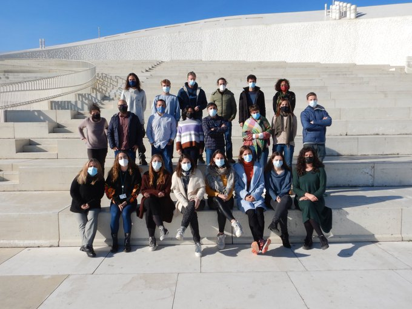
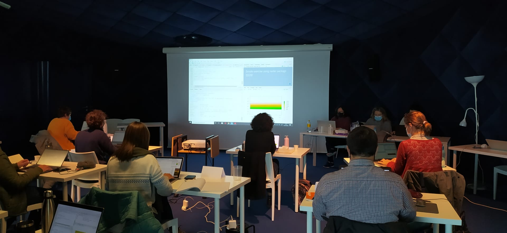

***

***

This project is developed at the University Rey Juan Carlos (Madrid, Spain) in collaboration with CIIMAR (Matosinhos, Portugal). 

***
## Results

---

+ **MarHot in #IBSVancouver2022**

Some preliminary results from MarHot were presented at the IBS Vancouver 2022, the [10th Biennial Conference of the International Biogeography Society](https://web.cvent.com/event/437755ba-3761-4eea-9c20-aca221ba457d/summary).

Results were presented during the CHANGING OCEAN ECOLOGY AND BIOGEOGRAPHY Symposium organized by Mary O'Connor. 

It was a great pleasure to be among relevant leaders of the marine research (John Grady, Amanda Bates, Chris Harley, Lauren Schiebelhut, Sergio Navarette, and Catalina Pimiento) and discuss with them.

---

+ **MarHot in 'Madrid es Ciencia'**

'Madrid es Ciencia' is a comprehensive exhibition of scientific-technological innovation in the Community of Madrid. 

**MarHot** research was shown in a video exhibited at the University Rey Juan Carlos stand together with a sample of the research carried out in the Area of Biodiversity and Conservation (Biodiversos).

The video exhibited can be viewed [here](https://www.instagram.com/tv/CapYjHeAYbX/?utm_medium=copy_link)

---

+ The ["Aquatic Species Distribution Modelling Workshop"](https://www2.ciimar.up.pt/events.php?id=284) took place in December 2021. 

We taught many colleagues interested in aquatic applications of SDMs.
Thanks to MarHot and Seeingshore projects.

