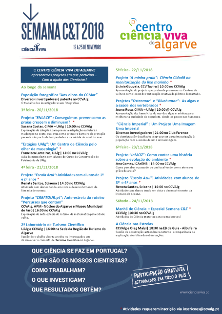
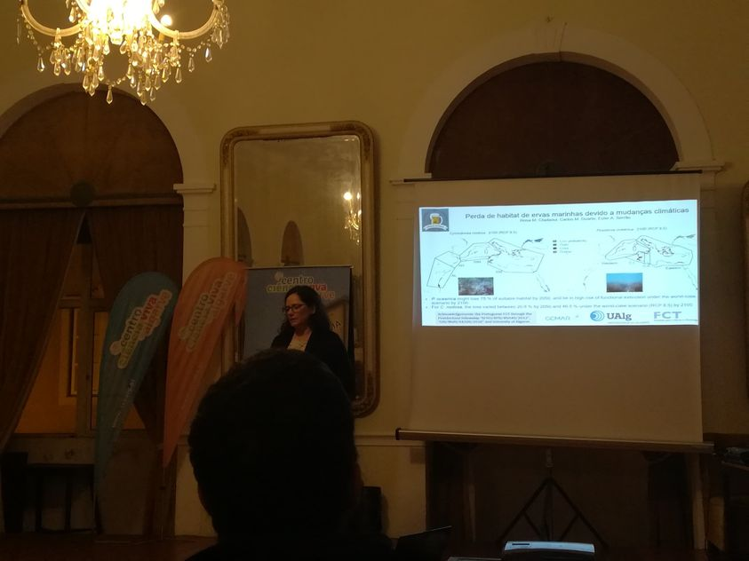

***

## Webinar Humboldt Day

The International Biogeography Society (IBS) hosted the International Humboldt Day during the week surrounding September 14th 2020. IBS invited [MadresBDV](https://www.usc.gal/gl/investigacion/proxectos/madresbdv/somos.html) to organize an event. Carola, Esther, Elena, Sara, Marta and I organized the event: [“Finding ways to feature and support more Women in Biogeography“](https://www.humboldtday.org/event/finding-ways-to-feature-and-support-more-women-in-biogeography/?wcs_timestamp=1600095635).

We had speakers from different scientific areas related to Biogeography: Maria Dornelas, Christine Meynard, Anna Traveset and Kathy Willis. The webinar was recorded, so you can see it again.

***

## Press releases

+ [Abandonment of traditional saltworks facilitates degradation of halophytic plant communities and Carpobrotus edulis invasion.](https://jvsavsblog.org/2019/03/13/abandonment-of-traditional-saltworks-facilitates-degradation-of-halophytic-plant-communities-and-carpobrotus-edulis-invasion/) Blog of the Journal of Vegetation Science and Applied Vegetation Science.

+ [Abandono de salinas tradicionais facilita degradação de comunidades vegetais e invasão por chorão-da-praia](https://ce3c.ciencias.ulisboa.pt//outreach/press&events/ver.php?id=1074) Newsletter cE3c Centre for Ecology, Evolution and Environmental Changes (In Portuguese).

+ [Habitat loss and possible extinction of seagrasses in the Mediterranean Sea](https://www.ccmar.ualg.pt/news/perda-de-habitat-e-possivel-extincao-de-ervas-marinhas-no-mediterraneo) CCMAR web (In Portuguese).

+ [Adiós a la Posidonia en el Mediterráneo](https://www.elasterisco.es/posidonia/#.X74kJ3Xnj6i) El Asterisco (In Spanish).

+ [Documentan la historia evolutiva de tres especies de arbustos de zonas áridas](https://www.mncn.csic.es/es/Comunicaci%C3%B3n/documentan-la-historia-evolutiva-de-tres-especies-de-arbustos-de-zonas-aridas) Museo
Nacional de Ciencias Naturales (In Spanish).

+ [Investigadores del MNCN documentan la historia evolutiva de tres especies de arbustos de zonas áridas](https://www.elperiodico.com/es/sociedad/20170411/investigadores-del-mncn-documentan-la-historia-evolutiva-de-tres-especies-de-arbustos-de-zonas-aridas-5967755) El Periódico (In Spanish).

+ [Cómo han evolucionado tres especies de arbustos en zonas áridas](https://www.agenciasinc.es/Noticias/Como-han-evolucionado-tres-especies-de-arbustos-en-zonas-aridas) Sinc (In Spanish).

+ [Científicos españoles y portugueses describen la evolución de los tojos del sur de la Península Ibérica](https://www.lainformacion.com/asuntos-sociales/cientificos-espanoles-portugueses-describen-evolucion_0_1016298883.html) Lainformación.com (In Spanish).

+ [Cientistas desvendam história dos tojos que ajudam a manter a costa portuguesa](https://www.wilder.pt/historias/cientistas-desvendam-historia-dos-tojos-que-ajudam-a-manter-a-costa-portuguesa/) Wilder (In Portuguese).

+ [Investigadores del MNCN documentan la historia evolutiva de tres especies de arbustos de zonas áridas](https://www.telecinco.es/informativos/tecnologia/Investigadores-MNCN-documentan-historia-evolutiva_0_2353575153.html) Informativos telecinco (In Spanish).

+ [Investigadores del MNCN documentan la historia evolutiva de tres especies de arbustos de zonas áridas](https://www.lavanguardia.com/vida/20170411/421625372185/investigadores-del-mncn-documentan-la-historia-evolutiva-de-tres-especies-de-arbustos-de-zonas-aridas.html?utm_campaign=botones_sociales&utm_source=twitter&utm_medium=social) La Vanguardia (In Spanish).

***

## Photo contest 2019

[Photo contest: ’Aos Olhos do CCMAR’](https://www.facebook.com/CentrodeCienciasdoMar/photos/?tab=album&album_id=10157188606620844)  - photo contest 4th edition 2019. 
I presented a photograph showing how the abandonment of traditional saltworks have led to an expansion of Carpobrotus edulis and to a degradation of the communities of plants adapted to living in a saline environment. Carpobrotus edulis is original from South Africa and an invasive species in many coastal regions throughout the world. Here we see how this species has expanded to invade abandoned saltworks close to the Faro Airport (Portugal).

***

## Science Week 2018

**Semana C&T 2018**. “Ciência Imperial”: Um projeto, uma Imagem, uma Imperial!

Nice event at which scientists are challenged to present their research to the population with the help of a single image in an informal setting.

The event took place at the Club Farense, a centuries-old cultural association.
I introduced my work on habitat loss of seagrass due to climate change. There were amazing presentations on shark movement, cancer, malaria treatments, plastic recycling…

Here is the [link](https://www.facebook.com/ccvalgarve/?__xts__[0]=68.ARAmk2IoSYqufqAp-ce9d16syv6BTUrhh8Ena1UZXarNJMq3BWa7JY9RMcBv7dyAuQBDmvHyY-tchIGhBVQfwaYHxEEQIo3Tpp9qnLk66yxIlUA_OieQd3yoray8-ZAhqwAj-yvwYdiuwvvDtPrjK69Mi7sfkx4bq81z51-bHbmoEMPhNnLk0qRwr1XURl4qZfw4l_eLoxZLH_ssPg1EFC9Jqy8hLWlN-kaS5dEXCbEWLtXWiSu5CVX6VUIZnxgpfYQKNcJ0rdrU3BnBwZu8TP0N6t5bfnwHqLuhzovdBy8Mz6vW4Lqd5M9TyMVuie7jCZ6FPX0sNyo9zb3eVRH-sgTbrQ&tn-str=k*F) to some photographs of the event made available by the organizer Centro Ciência Viva do Algarve.

***

## Science Week 2016

[Semana de Cultura Científica do Centro de Ciências do Mar (CCMAR)](https://www.ccmar.ualg.pt/en/activity/semana-da-cultura-cientifica-do-ccmar-2016) 3 minutes oral talk on Prediction of Cymodocea nodosa seagrass meadows.

***

## Science Week 2015

Semana de Cultura Científica do Centro de Ciências do Mar (CCMAR). Poster: Can we use niche models of indicator species to predict the distribution of endangered communities?

