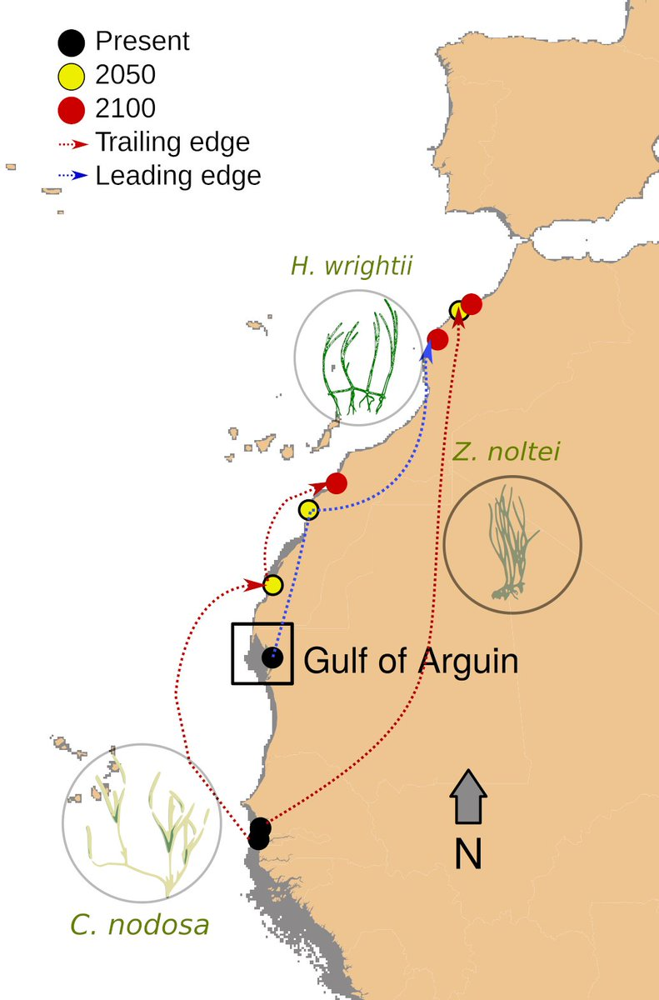
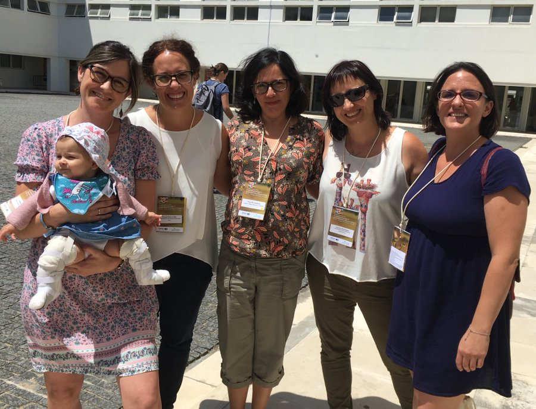
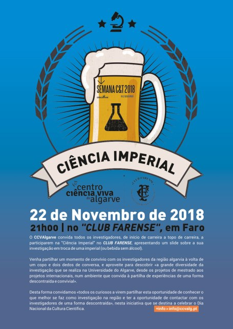
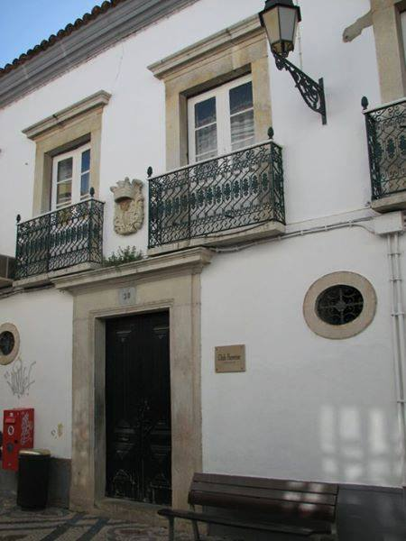
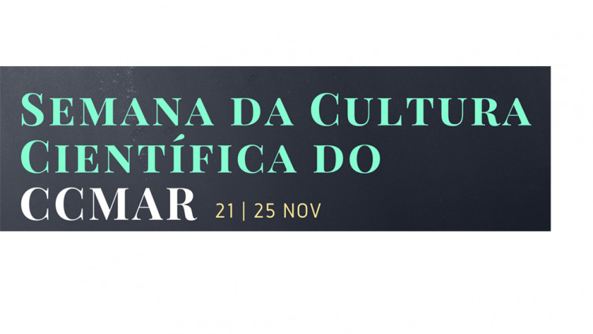

***

---

## SEMINAR at the Museo Nacional de Ciencias Naturales 
Madrid (25 Nov. 2022)

'Effects of climate change on marine macrophytes'. Temporal analysis of warming-driven distributional changes in macrophytes. 

The talk can be seen at [YouTube](https://www.youtube.com/watch?v=iRdZHncZZPU&ab_channel=MuseoNacionaldeCienciasNaturales%28MNCN-CSIC%29)

---

## Speaker at the IBS VANCOUVER 2022

IBS Vancouver 2022 is the [10th Biennial Conference of the International Biogeography Society](https://web.cvent.com/event/437755ba-3761-4eea-9c20-aca221ba457d/summary)

Very happy to have been invited as speaker to the CHANGING OCEAN ECOLOGY AND BIOGEOGRAPHY
Symposium and have the opportunity to exchange ideas with such amazing marine ecologists.

---

## WORKSHOP: 

Identifying Priorities for Conservation, Monitoring and Research of Seagrass Ecosystems in Europe (22-24 March 2022)

Organized in the context of EuroSea Project. 40 participants from 27
European countries. [Link](https://www.goosocean.org/index.php?option=com_oe&task=viewDocumentRecord&docID=30378)

---

## MADRID ES CIENCIA (IFEMA, Madrid, 2-5 March 2022)

The Area of Biodiversity and Conservation (Biodiversos) was at the stand of the University Rey Juan Carlos and we could explain our research to many students.

**MarHot** research was shown in a video exhibited... see more [here](https://chefaoui.github.io/MarHot.html)

---

## Paper on the future of seagrasses in Banc d'Arguin (Mauritania)

Seagrass meadows in Banc d’Arguin (Mauritania), one of the largest in the world, can suffer a regime shift along the 21st century due to increasing sea temperatures and sea level rise with climate change.

We produced a fine scale Digital Elevation Model (DEM) by coupling bathymetric and elevation data from different sources using rstats, QGIS and SAGA to estimate the vertical niche for each species conditioned by future sea level rise.

We forecast a contraction of the temperate *Cymodocea nodosa* (widest and largest leaves) and *Zostera noltei* (the one with thickest meadows) at their trailing (southern) edges, whereas the tropical *Halodule wrightii* (thin and sparse) would experience a northward expansion beyond its current northern edge at the Gulf of Arguin.

You can check more here:

Predicted regime shift in the seagrass ecosystem of the Gulf of Arguin driven by climate change *Global Ecology and Conservation* 32: e01890. https://www.sciencedirect.com/science/article/pii/S2351989421004406?via%3Dihub

---

## Paper on waterbird ecological networks

The findings enhance the role of the active saltpans located in the Ria Formosa Natural Park (Algarve, Portugal) as a key site for the conservation of resident and migratory waterbirds.

This research explores the spatial and temporal dynamics of coastal communities. I used Bipartite ecological networks to model relations between the bird species and surveyed saltpans. It was an useful approach to integrate ecologically meaningful zero count data.

Data and R script to reproduce the analyses and figures are available in my GitHub page:
https://github.com/Chefaoui/Chefaoui_2021

You can check the publication here:

Seasonal variations of waterbird ecological networks under different saltpans management. *Ecological Informatics* 64: 101364. https://doi.org/10.1016/j.ecoinf.2021.101364

---
## Webinar Humboldt Day

The International Biogeography Society (IBS) hosted the International Humboldt Day during the week surrounding September 14th 2020. IBS invited [MadresBDV](https://www.usc.gal/gl/investigacion/proxectos/madresbdv/somos.html) to organize an event. Carola, Esther, Elena, Sara, Marta and I organized the event: “Finding ways to feature and support more Women in Biogeography“.  

We had speakers from different scientific areas related to Biogeography: Maria Dornelas, Christine Meynard, Anna Traveset and Kathy Willis. The webinar was recorded, so you can see it again.

You can watch the video [here](https://www.youtube.com/watch?v=E1wi5yhx5Y8&ab_channel=InternationalHumboldtDay).

***
## Invited Speaker at the EEF 2019

Glad to attend and present at the "Evolutionary ecology in the marine realm" Symposium, [@eeflisbon2019](https://twitter.com/eeflisbon2019) my talk on "Climate-driven distributional shifts of seagrasses and algae: from past to future"

There I could contact with other mothers in STEM from [@madresBDV](https://twitter.com/madresBDV) (I was pregnant in that congress :)

***
## Press releases

+ [Abandonment of traditional saltworks facilitates degradation of halophytic plant communities and Carpobrotus edulis invasion.](https://jvsavsblog.org/2019/03/13/abandonment-of-traditional-saltworks-facilitates-degradation-of-halophytic-plant-communities-and-carpobrotus-edulis-invasion/) Blog of the Journal of Vegetation Science and Applied Vegetation Science.

+ [Abandono de salinas tradicionais facilita degradação de comunidades vegetais e invasão por chorão-da-praia](https://ce3c.ciencias.ulisboa.pt//outreach/press&events/ver.php?id=1074) Newsletter cE3c Centre for Ecology, Evolution and Environmental Changes (In Portuguese).

+ [Habitat loss and possible extinction of seagrasses in the Mediterranean Sea](https://www.ccmar.ualg.pt/news/perda-de-habitat-e-possivel-extincao-de-ervas-marinhas-no-mediterraneo) CCMAR web (In Portuguese).

+ [Adiós a la Posidonia en el Mediterráneo](https://www.elasterisco.es/posidonia/#.X74kJ3Xnj6i) El Asterisco (In Spanish).

+ [Documentan la historia evolutiva de tres especies de arbustos de zonas áridas](https://www.mncn.csic.es/es/Comunicaci%C3%B3n/documentan-la-historia-evolutiva-de-tres-especies-de-arbustos-de-zonas-aridas) Museo
Nacional de Ciencias Naturales (In Spanish).

+ [Investigadores del MNCN documentan la historia evolutiva de tres especies de arbustos de zonas áridas](https://www.elperiodico.com/es/sociedad/20170411/investigadores-del-mncn-documentan-la-historia-evolutiva-de-tres-especies-de-arbustos-de-zonas-aridas-5967755) El Periódico (In Spanish).

+ [Cómo han evolucionado tres especies de arbustos en zonas áridas](https://www.agenciasinc.es/Noticias/Como-han-evolucionado-tres-especies-de-arbustos-en-zonas-aridas) Sinc (In Spanish).

+ [Científicos españoles y portugueses describen la evolución de los tojos del sur de la Península Ibérica](https://www.lainformacion.com/asuntos-sociales/cientificos-espanoles-portugueses-describen-evolucion_0_1016298883.html) Lainformación.com (In Spanish).

+ [Cientistas desvendam história dos tojos que ajudam a manter a costa portuguesa](https://www.wilder.pt/historias/cientistas-desvendam-historia-dos-tojos-que-ajudam-a-manter-a-costa-portuguesa/) Wilder (In Portuguese).

+ [Investigadores del MNCN documentan la historia evolutiva de tres especies de arbustos de zonas áridas](https://www.telecinco.es/informativos/tecnologia/Investigadores-MNCN-documentan-historia-evolutiva_0_2353575153.html) Informativos telecinco (In Spanish).

+ [Investigadores del MNCN documentan la historia evolutiva de tres especies de arbustos de zonas áridas](https://www.lavanguardia.com/vida/20170411/421625372185/investigadores-del-mncn-documentan-la-historia-evolutiva-de-tres-especies-de-arbustos-de-zonas-aridas.html?utm_campaign=botones_sociales&utm_source=twitter&utm_medium=social) La Vanguardia (In Spanish).

***

## Photo contest 2019

[Photo contest: ’Aos Olhos do CCMAR’](https://www.facebook.com/CentrodeCienciasdoMar/photos/?tab=album&album_id=10157188606620844)  - photo contest 4th edition 2019. 
I presented a photograph showing how the abandonment of traditional saltworks have led to an expansion of Carpobrotus edulis and to a degradation of the communities of plants adapted to living in a saline environment. Carpobrotus edulis is original from South Africa and an invasive species in many coastal regions throughout the world. Here we see how this species has expanded to invade abandoned saltworks close to the Faro Airport (Portugal).

***

## Science Week 2018

**Semana C&T 2018**. “Ciência Imperial”: Um projeto, uma Imagem, uma Imperial!

Nice event at which scientists are challenged to present their research to the population with the help of a single image in an informal setting.

The event took place at the Club Farense, a centuries-old cultural association.
I introduced my work on habitat loss of seagrass due to climate change. There were amazing presentations on shark movement, cancer, malaria treatments, plastic recycling…

Here is the [link](https://www.facebook.com/ccvalgarve/?__xts__[0]=68.ARAmk2IoSYqufqAp-ce9d16syv6BTUrhh8Ena1UZXarNJMq3BWa7JY9RMcBv7dyAuQBDmvHyY-tchIGhBVQfwaYHxEEQIo3Tpp9qnLk66yxIlUA_OieQd3yoray8-ZAhqwAj-yvwYdiuwvvDtPrjK69Mi7sfkx4bq81z51-bHbmoEMPhNnLk0qRwr1XURl4qZfw4l_eLoxZLH_ssPg1EFC9Jqy8hLWlN-kaS5dEXCbEWLtXWiSu5CVX6VUIZnxgpfYQKNcJ0rdrU3BnBwZu8TP0N6t5bfnwHqLuhzovdBy8Mz6vW4Lqd5M9TyMVuie7jCZ6FPX0sNyo9zb3eVRH-sgTbrQ&tn-str=k*F) to some photographs of the event made available by the organizer Centro Ciência Viva do Algarve.

***

## Science Week 2016

[Semana de Cultura Científica do Centro de Ciências do Mar (CCMAR)](https://www.ccmar.ualg.pt/en/activity/semana-da-cultura-cientifica-do-ccmar-2016) 3 minutes oral talk on Prediction of Cymodocea nodosa seagrass meadows.

***

## Science Week 2015

Semana de Cultura Científica do Centro de Ciências do Mar (CCMAR). Poster: Can we use niche models of indicator species to predict the distribution of endangered communities?

