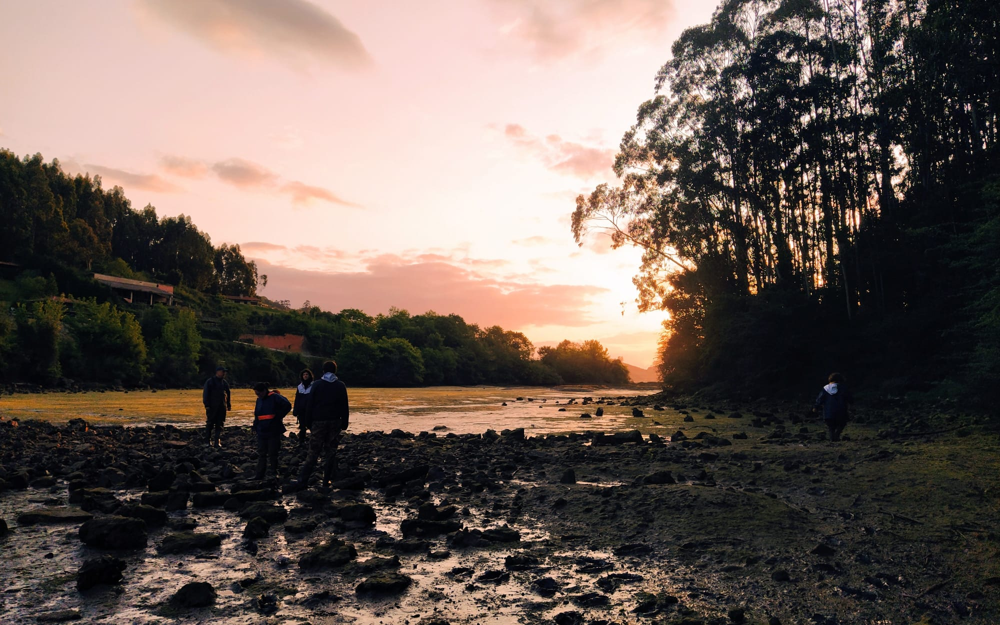
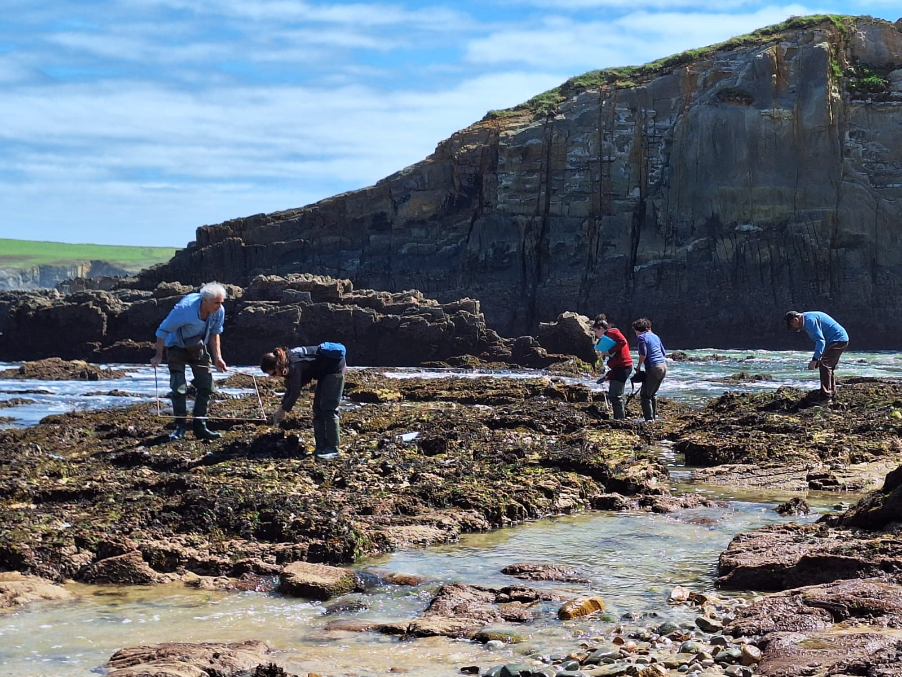
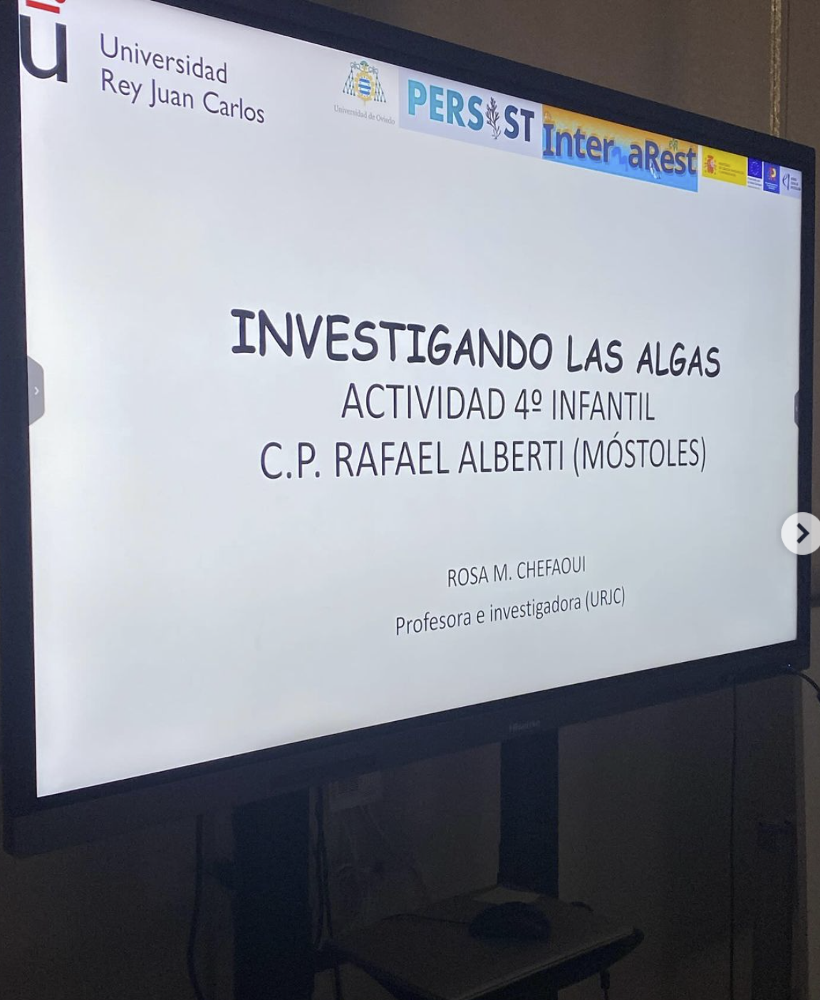
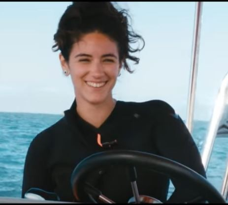
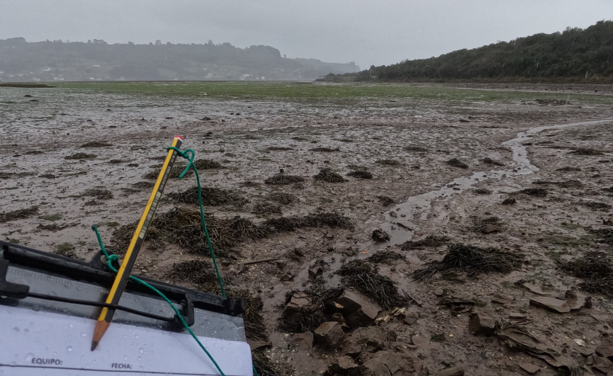
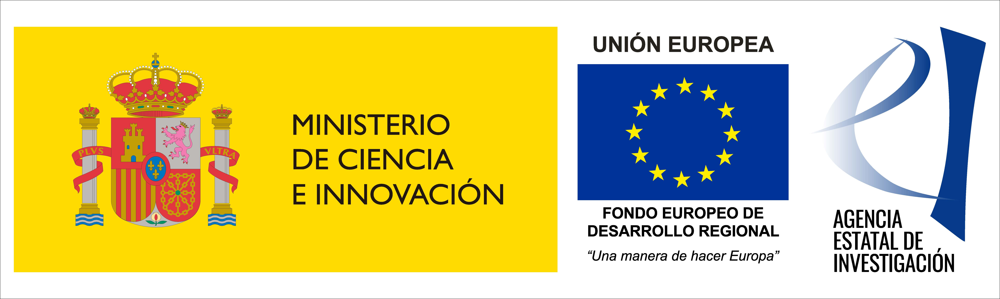

***

  
 

***
## 2023-2025 - PERSIST - 

Poblaciones de macroalgas en peligro de desaparición local: una evaluación multiescalar. 

Proyectos de Generación de Conocimiento 2021 (PID2021-124179OA-
I00). Ministerio de Ciencia e Innovación. Universidad Rey Juan Carlos y Universidad de
Oviedo.

  
  

***
## DISSEMINATION

NEWS: Julio Arrontes (Universidad de Oviedo) gave an overview of our projects in the [news](https://www.eldiario.es/asturias/expertos-alertan-desaparicion-lechos-algas-cantabrico-preocupa-quiera-preocuparse_1_11526894.html)

***

PERSIST was presented to 4 y.o. students of CP Rafael Alberti during their Cultural Week

More info at [ceiprafaelalberti Instagram](https://www.instagram.com/p/C4p744Mtb1Q/?igsh=ZXpoNjM2b3V1YXVr&img_index=1) (in Spanish)

***
## PERSIST technician 
 
**Ana Ramirez** has joined PERSIST... Welcome Ana!

***
## INTERTIDAL SAMPLING

Sampling campaigns of the PERSIST project started in January 2023.

***
