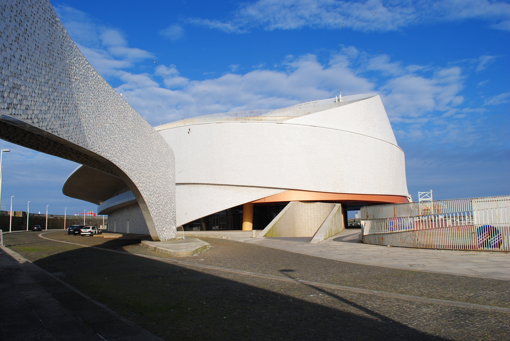
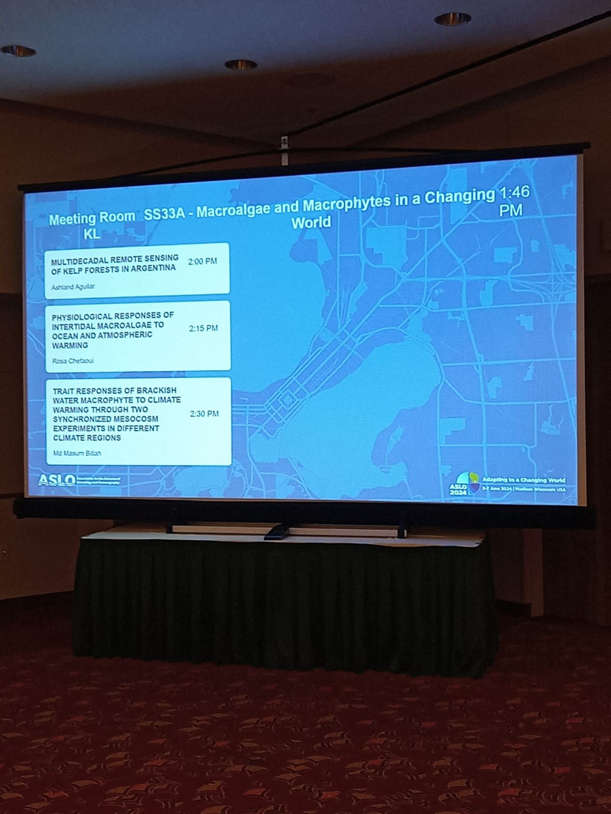

***

## Phymacro   
***

Phymacro is an **ASSEMBLE Plus** Transnational Access grant in the context of the European Union’s Horizon 2020 research and innovation program *(Grant Agreement No. 730984)*. 
In this project we investigated the physiological responses of marine macrophytes to ocean warming and desiccation stress.

***

*CIIMAR - Interdisciplinary Centre of Marine and Environmental Research*

Phymacro experiments were run at [CIIMAR - Interdisciplinary Centre of Marine and Environmental Research](https://www2.ciimar.up.pt/) (Porto, Portugal) during June 2021, in collaboration with the [Benthic Ecology group](https://www2.ciimar.up.pt/research.php?team=36) led by [Dr. Francisco Arenas](https://www.researchgate.net/profile/Francisco-Arenas).

*** 

*Experimental set up*

***

**Results**

Results from the project were presented at the ASLO 2024 Meeting (Madison, USA)

 
 
***
   “The research leading to these results received funding from the European Union’s Horizon 2020 research and innovation programme under grant agreement No 730984, ASSEMBLE Plus project”. 