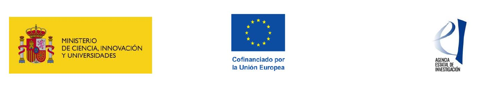

*** 

***
## Biogeografía Integradora y Cambio Global en Ecosistemas Costeros

Ayuda para contratos Ramón y Cajal (RYC) 2023 (RYC2022-037993-I) funded by the AGENCIA ESTATAL DE INVESTIGACION.

I will develop this project in the Instituto de Investigación en Cambio Global
(IICG-URJC) and the Departamento de Biología y Geología, Física y Química Inorgánica of the Universidad Rey Juan Carlos (Spain), from 2024-2029. 

