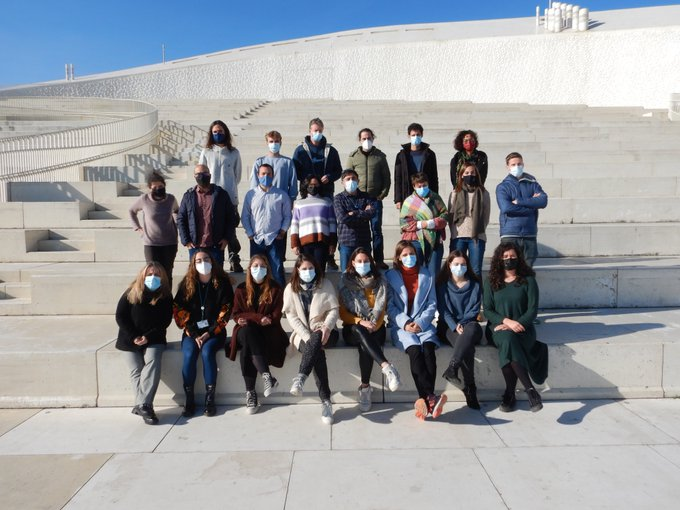
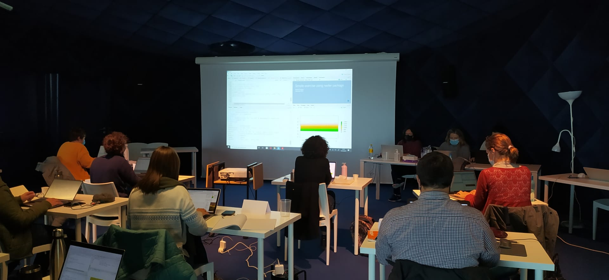

***

---

## Teaching at URJC

I am teaching at the Universidad Rey Juan Carlos since 2021. 
The subjects and grades in which I have been teaching over the years can be seen at [URJC Teaching web page](https://gestion2.urjc.es/pdi/ver/rosa.chefaoui)

---

## The **Aquatic SDM** Workshop

+ The ["Aquatic Species Distribution Modelling Workshop"](https://www2.ciimar.up.pt/events.php?id=284) took place in December 2021. 

We taught many colleagues interested in aquatic applications of SDMs.
Thanks to MarHot and Seeingshore projects.

