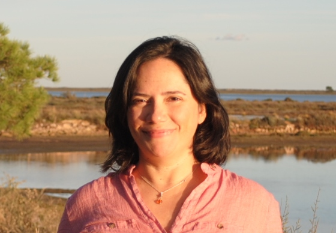
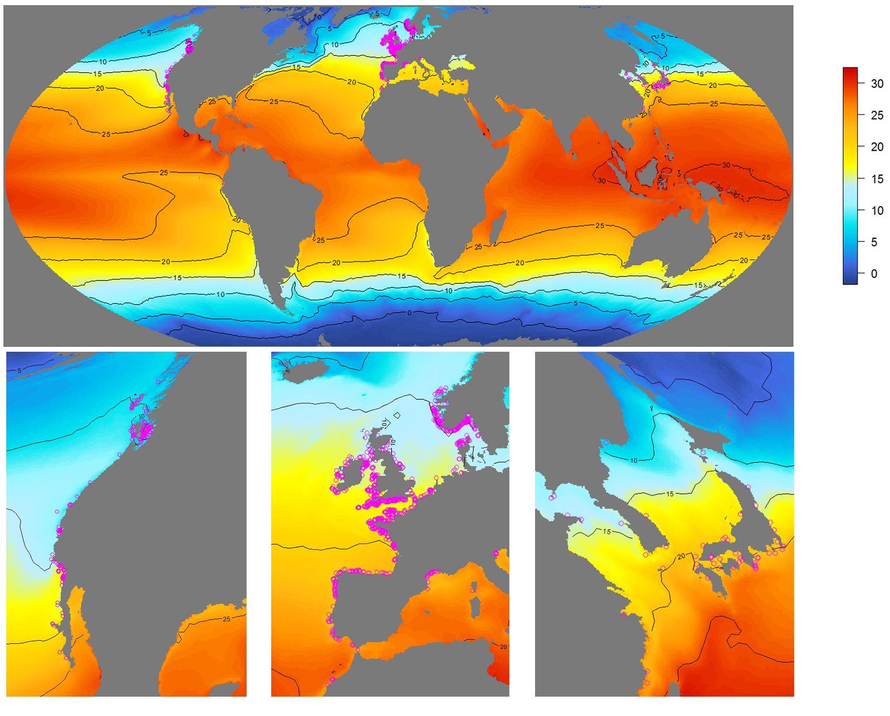
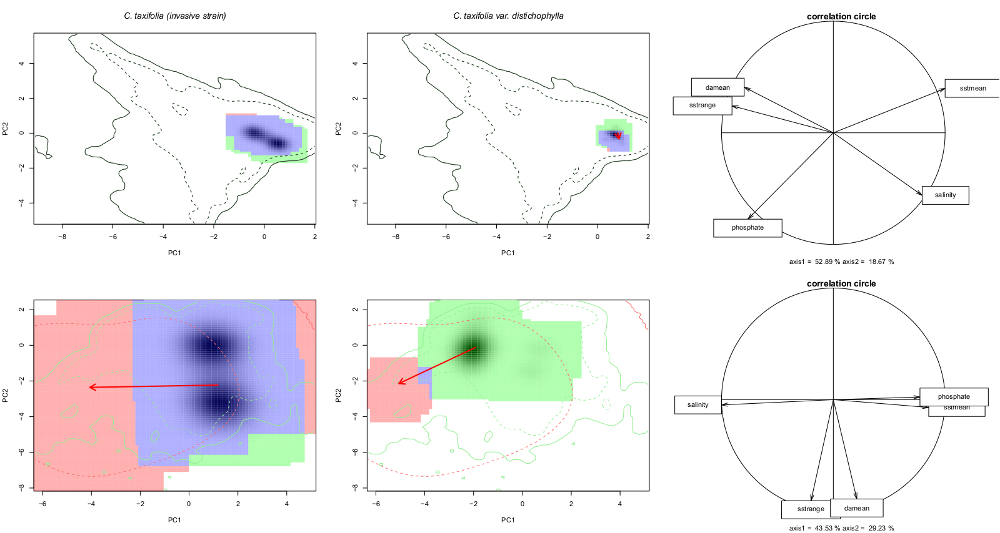
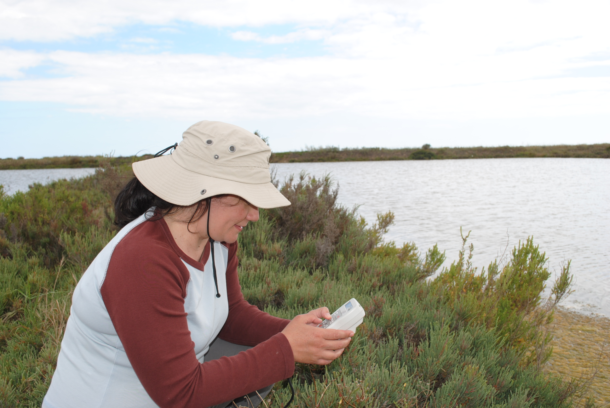

***
## **About me** 
***

I am currently a Marie Skłodowska-Curie postdoctoral fellow at the Universidad Rey Juan Carlos (Madrid, Spain). I am leading the European Union's Horizon 2020 funded **project MarHot**. This project will provide an innovative framework to integrate physiological thermal limits into species distribution models in order to anticipate future redistributions of marine coastal species. Find out more about MarHot [here](https://chefaoui.github.io/MarHot.html).

***
## **Short CV**
***
  
1997 BsC in Biological Sciences, Universidad Autónoma de Madrid (Spain)

1998 MSc in Education and Pedagogy, Universidad Complutense de Madrid (Spain)

1998-2013 Public High School Teacher of Biology and Geology. Madrid (Spain)

2010 PhD Thesis – Universidad Autónoma de Madrid (Spain)

2013-2018 Post-doc fellowship – Centro de Ciências do Mar (CCMAR). (Portugal)

2018-2020 Research Assistant – CCMAR, Universidade do Algarve (Portugal)

2021-2022 Marie Skłodowska-Curie Postdoc Fellow – Universidad Rey Juan Carlos (Spain)

*** 
## **Research Lines**
***

### Mechanistic models applied to climate change studies
There is a need to integrate physiological data better to improve the prediction of future distributional shifts at local and regional scales. 
My current research is mainly linked to MarHot and Phymacro European Union's Horizon 2020 funded projects and it is focused on the integration of physiological experiments with SDMs to investigate further mechanistic models taking marine foundational algae and kelps as model species. I will develop open software in R to make the mechanistic framework reproducible for all scientists.

*Sargassum muticum distribution in the Northern Hemisphere along its native range in Asia (right), and invaded European (middle) and North American (left) ranges.*

### Patterns of genetic diversity and range shifts of marine species
My post-doctoral **project INTERSEA** allowed me to investigate the response of marine species to environmental changes, integrating spatial analysis, niche modelling, and genetic data. This project was developed while I was FCT postdoctoral researcher and Research Assistant afterwards at the Centre of Marine Sciences (CCMAR; University of Algarve, Portugal).
I analyzed the predicted effects of climate change on the loss of genetic diversity of seagrass and seaweed populations. I used reconstructions of Last Glacial Maximum climate to identify past coastal regions acting as glacial refugia and areas of persistence, revealing now genetic signatures that are the result of accumulated genetic diversity. 

*Posidonia oceanica meadow. Photo credit: RM Chefaoui*

### Invasion process and prediction of invasion risk

I have paid particular attention to the study of invasive species by focusing on the effects of invasive species on the composition of communities, also by modelling their niche shift and future risk of invasion.

*Comparison of niche dynamics of the invasive lineages of Caulerpa taxifolia*

### Spatial and temporal dynamics of coastal communities
In this research line, I have incorporated field work of diverse coastal environments (dune habitats, saltworks, etc...). I explored a better understanding of the spatial variation of community composition data. The data compiled during these campaings will result in several publications on spatial variation in abundance both in marine and terrestrial realms. 

*Sampling halophytic plant communities in saltworks of the Ria Formosa, Portugal. Photo credit: Sergio Chozas*

***
## **Contact**
***

**Rosa M. Chefaoui**

*Universidad Rey Juan Carlos* 

*Calle Tulipán s/n* 

*28933 Móstoles, Madrid*

