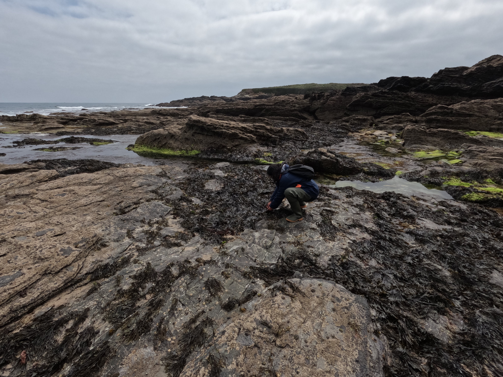

***
## **About me** 
***

I am a professor and researcher at the ["Instituto de Investigación en Cambio Global de la Universida Rey Juan Carlos (IICG-URJC)"](https://iicg-urjc.es/rosa-maria-chefaoui-diaz/) working in the [Area of Biodiversity and Conservation](https://biodiversos.org/). Currently, my research focuses on the effects of climate change on marine benthic species. I work at the interface of coastal ecology and biogeography, integrating modelling, spatial analyses (using GIS, thermal and drone imagery...), as well as field and physiological experiments. 

***
## **Short CV**
***

07/2024-present: **"Ramón y Cajal" Fellow** – Instituto de Investigación en Cambio Global (IICG-URJC) and Departamento de Biología y Geología, Física y Química Inorgánica. Universidad Rey Juan Carlos (Spain)

02/2024-06/2024: **Profesor Permanente Laboral** (Lecturer and Professor) – Universidad Rey Juan Carlos (Spain)

05/2023-02/2024: **Assistant Professor** – Universidad Rey Juan Carlos (Spain)

01/2023-04/2023: **Distinguished Researcher** – Universidad Rey Juan Carlos (Spain)

2021-2022: **Marie Skłodowska-Curie Postdoc Fellow** – Universidad Rey Juan Carlos (Spain)

2018-2020: **Research Assistant** – CCMAR, Universidade do Algarve (Portugal)

2013-2018: **Post-doc fellow FCT** – Centro de Ciências do Mar (CCMAR). (Portugal)

2010: **PhD Thesis** – Universidad Autónoma de Madrid (Spain)

1998-2013: **Public High School Teacher of Biology and Geology**. Madrid (Spain)

1998: **MSc in Education and Pedagogy**, Universidad Complutense de Madrid (Spain)

1997: **BsC in Biological Sciences**, Universidad Autónoma de Madrid (Spain)

*** 
## **Research Lines**
***

### Physiological and "in situ" experiments applied to intertidal macroalgae
There is a need to integrate physiological and experimental data to better understand ecological processes and changes at multiple spatial and temporal scales.
These experimental approaches are linked to my most recent projects:   [Marhot](https://chefaoui.github.io/MarHot.html), [Phymacro](https://chefaoui.github.io/Phymacro.html), [PERSIST](https://chefaoui.github.io/PERSIST.html) and [InterMaRest](https://chefaoui.github.io/IntermaRest.html).

  
   

***

### Seaweed and seagrass restoration
**Seaweed restoration**: In [InterMaRest](https://chefaoui.github.io/IntermaRest.html) project we are working to improve the survival of endangered populations of intertidal algae species of the North Iberian Peninsula.

**Seagrass restoration**: I collaborate in [RESTORESEAGRASS](https://webgate.ec.europa.eu/life/publicWebsite/project/LIFE23-NAT-PT-RESTORESEAGRASS-101148241/large-scale-conservation-and-restoration-of-critically-threatened-seagrass-habitat-on-atlantic-infralittoral-sand-and-coastal-lagoons), a LIFE project coordinated by the Centre of Marine Sciences (CCMAR; University of Algarve, Portugal). 

***

### Mechanistic models applied to climate change studies
Integrating physiological data and/or sea level rise into Species Distribution Models (SDMs) can help us improve the prediction of future distributional shifts. 

*Sargassum muticum distribution in the Northern Hemisphere along its native range in Asia (right), and invaded European (middle) and North American (left) ranges.*

***

### Patterns of genetic diversity and range shifts of marine species
My post-doctoral **project INTERSEA** allowed me to investigate the response of marine species to environmental changes, integrating spatial analysis, niche modelling, and genetic data. This project was developed while I was FCT postdoctoral researcher and Research Assistant afterwards at the Centre of Marine Sciences (CCMAR; University of Algarve, Portugal).
I analyzed the predicted effects of climate change on the loss of genetic diversity of seagrass and seaweed populations. I used reconstructions of Last Glacial Maximum climate to identify past coastal regions acting as glacial refugia and areas of persistence, revealing now genetic signatures that are the result of accumulated genetic diversity. 

*Posidonia oceanica meadow. Photo credit: RM Chefaoui*

***

### Invasion process and prediction of invasion risk

I have paid particular attention to the study of invasive species by focusing on the effects of invasive species on the composition of communities, also by modelling their niche shift and future risk of invasion.

*Comparison of niche dynamics of the invasive lineages of Caulerpa taxifolia*

***

### Spatial and temporal dynamics of coastal communities
In this research line, I have incorporated field work of diverse coastal environments (dune habitats, saltworks, etc...). I explored a better understanding of the spatial variation of community composition data. The data compiled during these campaings will result in several publications on spatial variation in abundance both in marine and terrestrial realms. 

*Sampling halophytic plant communities in saltworks of the Ria Formosa, Portugal. Photo credit: Sergio Chozas*

***
## **Contact**
***

**Rosa M. Chefaoui**

[E-mail](mailto:rosa.chefaoui@urjc.es)

[Instituto de Investigación en Cambio Global (IICG-URJC)](https://iicg-urjc.es/rosa-maria-chefaoui-diaz/)

[Departamento de Biología y Geología, Física y Química Inorgánica](http://biodiversos.org/)

*Universidad Rey Juan Carlos*, 
*Calle Tulipán s/n*, 
*28933 Móstoles, Madrid*.

